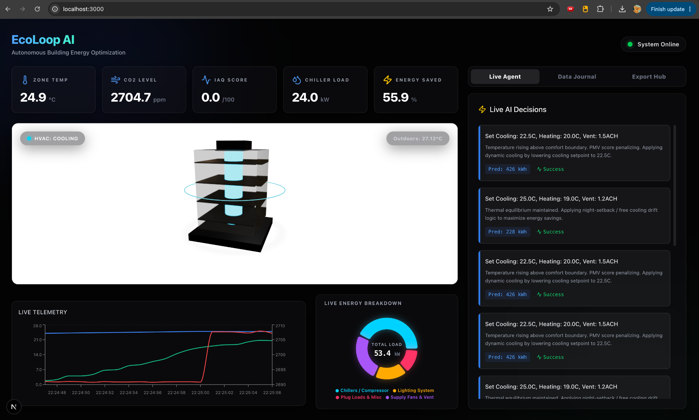
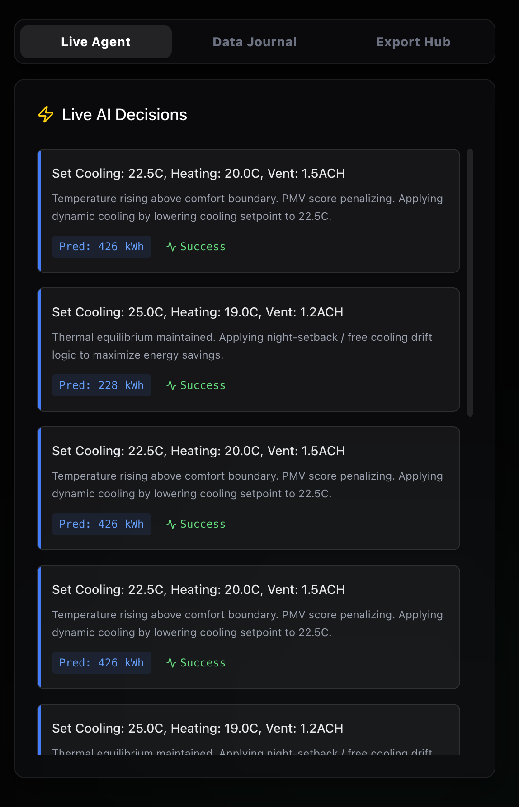
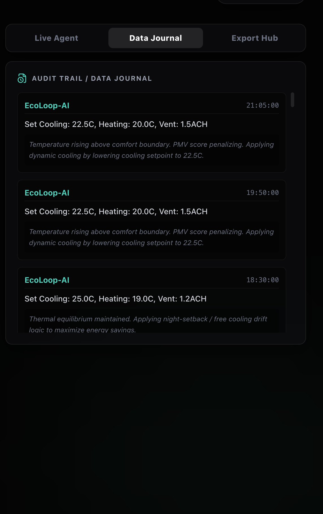
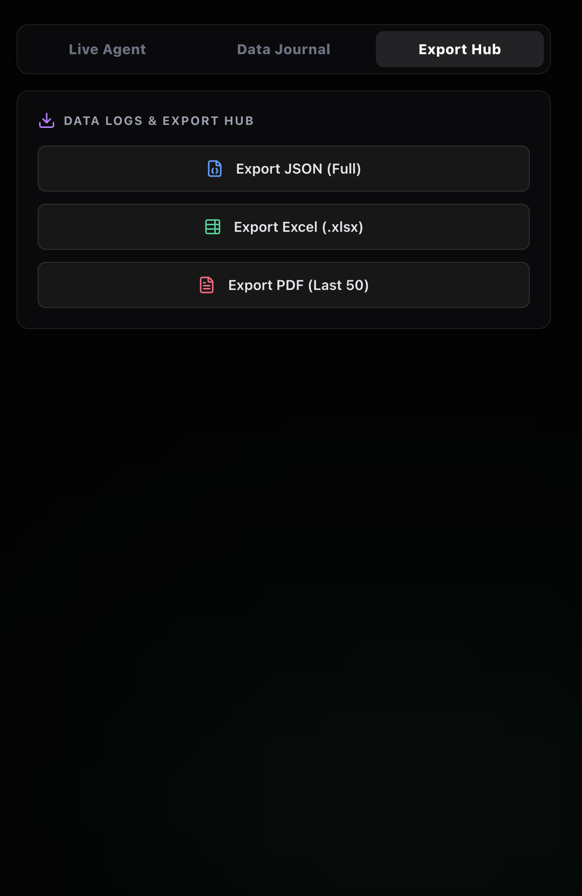

# EcoLoop AI 🌍

EcoLoop AI is a **Physical AI Proof-of-Concept (PoC)** that autonomously optimizes commercial building energy systems. By combining a physics-based building simulation engine with open-source Large Language Models (LLMs) and the Model Context Protocol (MCP), EcoLoop AI transforms buildings into intelligent, self-correcting systems capable of continuously minimizing energy consumption while maintaining occupant comfort.

---

# 🏆 Hackathon Deliverables

This repository contains a complete closed-loop AI-powered smart building platform.

## ✨ Key Features

- 🧠 AI-powered autonomous HVAC optimization
- 🏢 Physics-based building digital twin
- ⚡ Real-time energy optimization
- 📊 Live KPI dashboard
- 📈 Historical telemetry visualization
- 📒 AI decision journal
- 📤 Export reports (Excel & PDF)
- 🔌 MCP-enabled AI agent communication

---

## 📸 Dashboard Preview

### Main Dashboard

Displays the live building digital twin, real-time telemetry, and energy savings.



---

### Live AI Agent

Shows autonomous HVAC decisions generated by the LLM together with execution status.



---

### Data Journal

Complete audit trail of every AI decision with timestamps.



---

### Export Hub

Export telemetry and AI decision logs in Excel and PDF formats.



---

# ⚙️ System Components

## 1. Simulation Engine (EnergyPlus + Surrogate Physics Model)

### EnergyPlus Building Models

Located in:

```
simulation-engine/energyplus_models/
```

These `.idf` files serve as the digital twin of the commercial building.

### High-Speed Surrogate Engine

Located in:

```
simulation-engine/app/services/simulation.py
```

Instead of running full EnergyPlus simulations during demonstrations, a surrogate physics model simulates:

- Indoor temperature
- HVAC load
- CO₂ accumulation
- Occupancy effects
- Thermal dynamics

This enables real-time visualization.

### Real-world Dataset

Simulation uses

- New York Summer Heatwave (July 2023)
- ASHRAE Commercial Building Load Profiles

making the optimisation scenario realistic.

---

## 2. Cognitive Engine (LLM + MCP)

Located in

```
cognitive-agent/src/agent.py
```

The AI Agent

- Connects using WebSockets
- Receives live telemetry
- Calls MCP tools
- Predicts optimal HVAC actions
- Sends updated control setpoints
- Continuously improves building efficiency

---

## 3. Savings Dashboard

Built using

- Next.js
- React
- React Three Fiber
- Tailwind CSS

Features include

- Interactive 3D Building Digital Twin
- Live Temperature
- CO₂ Monitoring
- IAQ Score
- HVAC Load
- Energy Saved (%)
- Decision Journal
- Excel Export
- PDF Export

---

# 📂 Project Structure

```
EcoLoop-AI/
│
├── cognitive-agent/
├── simulation-engine/
├── savings-dashboard/
├── docs/
│   ├── images/
│   │   ├── dashboard-main.png
│   │   ├── live-agent.png
│   │   ├── data-journal.png
│   │   └── export-hub.png
│   ├── ARCHITECTURE.md
│   └── PRESENTATION.md
│
├── scripts/
│   └── run_local.sh
│
└── README.md
```

---

# 🚀 Running the Project

## Requirements

- Python 3.9+
- Node.js 18+

---

## Installation

```bash
chmod +x scripts/run_local.sh
./scripts/run_local.sh
```

The script automatically

- Creates a virtual environment
- Installs Python packages
- Installs Node dependencies
- Starts FastAPI backend
- Starts MCP Agent
- Starts Next.js Dashboard

---

## Dashboard

Open

```
http://localhost:3000
```

Wait approximately **10–15 seconds** for the development server to compile.

Once connected, live telemetry and AI optimisation begin streaming.

---

# 🧠 System Architecture

For implementation details, communication flow, and AI orchestration, see

```
docs/ARCHITECTURE.md
```

---

# 📊 Presentation

The complete hackathon presentation is available in

```
docs/PRESENTATION.md
```

---

# 🛠️ Technology Stack

- Python
- FastAPI
- EnergyPlus
- MCP (Model Context Protocol)
- Open-source LLMs
- WebSockets
- Next.js
- React
- React Three Fiber
- Tailwind CSS

---

# 📄 License

This project was developed as a Proof-of-Concept for an AI Smart Building Hackathon and is intended for research and educational purposes.
